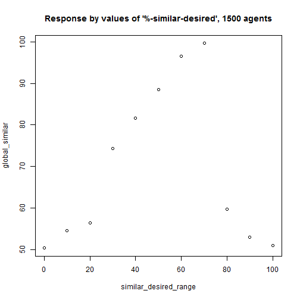
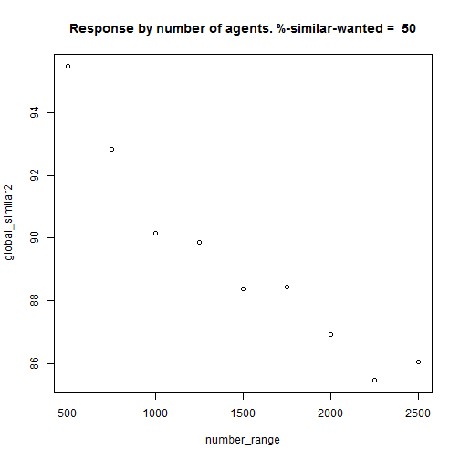
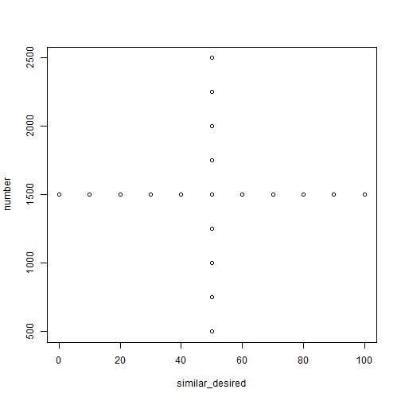
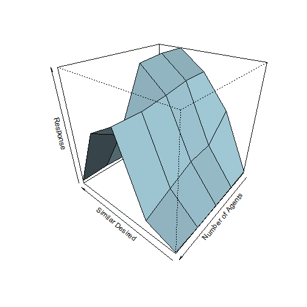
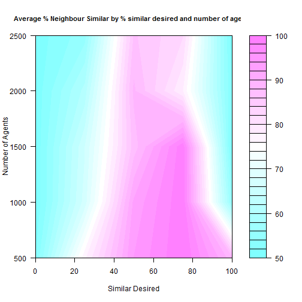
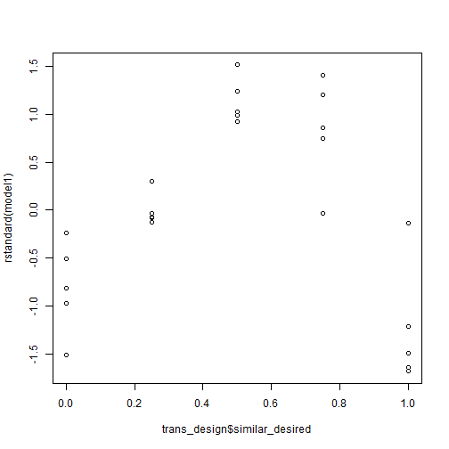
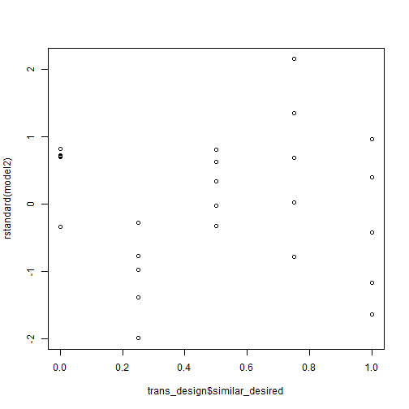
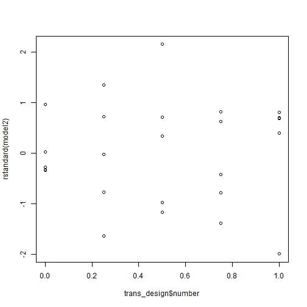
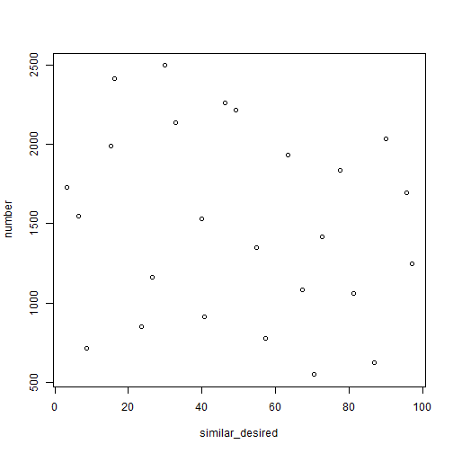

Design and Analysis of Computer Experiments
========================================================


**Jason Hilton and Jakub Bijak** - University of Southampton 

Workshop given for IDEM 112 'Agent-based modelling and simulation'  
Part of the MPIDR [International Advanced Studies in Demography series](http://www.demogr.mpg.de/en/education_career/international_advanced_studies_in_demography_3279/default.htm)

Location: Max Planck Institute for Demographic Research, Rostock  
Date: 30^th^ October 2014

***

#Introduction 

In this workshop, we shall work through examples of a number of the techniques discussed in the preceding lectures. 

All files and supporting information are available on the github page [https://github.com/jasonhilton/Comp_Exp_Workshop](https://github.com/jasonhilton/Comp_Exp_Workshop).

I shall try to keep the R code is clear as possible throughout, and include comments and explanations in the text, but remember that you can use the '?' command to access the R help for any command if necessary.
Try this for the *lapply* is you are not already familiar with it. 

This workshop leans heavily on ideas from 
Managing Uncertainty in Complex Models Toolkit (2011), MUCM project, [http://mucm.aston.ac.uk/toolkit/index.php?page=MetaHomePage.html](http://mucm.aston.ac.uk/toolkit/index.php?page=MetaHomePage.html)
Santer, W., Williams, B, and Notz, W (2003)  *'Design and Analysis of Computer Experiements'*, Springer

We are also using fewer simulation runs than we might generally wish for. This is largely because we want you to spend more time trying out the various methods, and less time waiting for simulations to finish running!

#Part 1: Experimental Designs and Simple Metamodels  

## A First Experiment  
We will start by running some very simple experiments to examine some of the ideas discussed in the lecture. 

We will run netlogo through R using the RNetLogo Library, which you are all familiar with. 
You will need to edit the nl.path variable to point to the folder where netlogo is installed on your machine.

Notice the 'gui' option has been set to false throughout this workshop, as running in 'headless' mode results in quicker runs. The gui is great for development, debugging and demonstration, but not necessarily much use for 'production' runs (ie, those required to produce your results).


```r
library(RNetLogo)
### CHANGE THIS PATH if necessary ###
nl.path<- "C:\\Program Files (x86)\\NetLogo 5.0.4"
NLStart(nl.path, gui=F)
```

```
## Error: Name of object (nl.obj) to store the NetLogo instance
##       is already in use. Please quit the used object first or choose a different name.
```

Our first experiment subject is Schelling's famous segregation model. Most of you will I expect already be familiar with this model by now, but a brief summary is given below in any case.

This examines how individual's moderate preference for living with those similar to themselves can lead to almost complete separation of different types of people. The model aims to show how observed macro-level racial segregation patterns in American cities need not have been caused by explicit racism, but may emerged out of weaker micro-level preferences.

This is one of the standard NetLogo models, so we can load it from the model library as below. 


```r
model.path <- "/models/Sample Models/Social Science/Segregation.nlogo"
NLLoadModel(paste(nl.path,model.path,sep=""))
```

Recall, we are interested in how our model **inputs** map to outputs or **responses**.
In this case we have two main inputs - the micro-level preference for similar agents, and the total number of agents present. Given the fixed grid size of $51*51$ patches, this latter input can also be thought of as the population density of the area in question. The output is the average proportion of similar neighbours over all agents - a proxy for segregation. 

Let's run the simulation at one combination of inputs and print the output to the screen.

```r
NLCommand("set %-similar-wanted 50")
NLCommand("set number 1500")
NLCommand("setup")
NLDoCommand(100,"go")
NLReport("percent-similar")
```

```
## [1] 88.89
```

Here we see that for agents desiring at least half of their neighbours to be similar to themselves, together with a population density of $\frac{1500}{51^{2}} =$ 0.5767, the average proportion of similar agents in a neighbourhood is around about 90%. 

##Exploring the Parameter Space

We want to examine how this response varies over the parameter space. An obvious - though not necessarily optimal - place to start is to hold one input steady while varying the other. 


```r
# Our desired inputs - a sequence from 0 to 100 increasing by 10 for similar
similar_desired_range <- seq(0,100,10)
number<-1500

runModel<-function(similar,num){
  # function running the model for 50 ticks at inputs 'similar' and 'num' 
  # returning the global proportion similar
  NLCommand("set %-similar-wanted", similar)
  NLCommand("set number", num)
  NLCommand("setup")
  NLDoCommand(50,"go")
  return(NLReport("percent-similar"))
}

# Apply the function runModel to each value in similar_desired, 
# holding number of agents constant at 'number', returning results as an array.
global_similar<-sapply(similar_desired_range, runModel, num=number)

# plot the results 
plot(similar_desired_range, global_similar, 
     main=paste("Response by values of '%-similar-desired',", number, "agents"))
```

 

By observation, it seems that segregation increases with micro-level preference for similar neighbours up to a threshold of about 70-80% desired similar neighbours, at which point there is a sharp decrease to the 50%. Why might this be the case?

Similarly, we can hold '%-similar-desired' steady, and vary only the number of agents in the simulation ( and by extension the population density)


```r
  similar_desired <- 50
  number_range<-seq(500,2500,250)
  global_similar2<-sapply(X=number_range, runModel, similar = similar_desired)
  plot(number_range, global_similar2, 
       main = paste("Response by number of agents. %-similar-wanted = ", similar_desired ))
```

 

Here it seems as though increasing the number of agents decreases segregation, although note the scale on the y-axis.

By holding the one parameter fixed while varying the other, we are preventing ourselves from identifying any interaction between the variables, and leaving large areas of the parameter space unobserved. 

We can see this by simply plotting our design:


```r
# here I simply combine all inputs in a single data frame. 
design<-data.frame(similar_desired=c(similar_desired_range,
                                   rep(similar_desired, length(number_range))),
                  number=c(rep(number,length(similar_desired_range)), 
                                     number_range))
plot(design)
```

 

To examine the corners of the parameter space, and to attempt to capture interactions between the variables, we will now run our simulation on a full factorial design. 
We will use 5 levels (this may take a few moments to run)  


```r
fact_design<-expand.grid(similar_desired=seq(0,100,25), number=seq(500,2500,500))

plot(fact_design)
```

 

```r
fact_response<-mapply(runModel, fact_design$similar_desired, fact_design$number)
```

We can plot this as a surface using the persp command:


```r
persp(unique(fact_design$similar_desired),
      unique(fact_design$number), 
      matrix(fact_response,nrow=5),
      xlab="Similar Desired",
      ylab="Number of Agents",
      zlab="Response",
      theta=220,
      phi=30,
      shade=0.6,
      col="lightblue"
      )
```

 

This looks nice, but generally a contour plot is easier to interpret, and requires
less tuning to find a good viewing angle. 


```r
filled.contour(unique(fact_design$similar_desired),
      unique(fact_design$number), 
      matrix(fact_response,nrow=5),
      xlab="Similar Desired",
      ylab="Number of Agents",
      main="Average % Neighbour Similar by % similar desired and number of agents",
      cex.main=0.9)
```

 

With both these methods, we have to be carefull to realise that the plot algorithms are interpolating between the points we have observed using a simple (meta)model.


# Response surfaces
Now we can start fitting some simple meta-models.
Often it is preferable to standardise the input space so that we can easily compare the effect of different inputs through their regression coefficients.


```r
transformInput<-function(input, location, multiplier){
  transformed_input<-input-location
  return(transformed_input/multiplier)
}


locations<-apply(fact_design,2,min)
multipliers<-apply(fact_design,2,max)- locations

trans_design<-data.frame(mapply(transformInput, fact_design, locations, multipliers))

# for convenience, lets add our outputs as a column in the same data frame
trans_design$response<-fact_response
```

We will start by fitting just a main effect to each input


```r
model1<-with(trans_design, lm(response ~ similar_desired + number))
summary(model1)
```

```
## 
## Call:
## lm(formula = response ~ similar_desired + number)
## 
## Residuals:
##    Min     1Q Median     3Q    Max 
## -27.88 -13.44  -1.22  15.84  25.13 
## 
## Coefficients:
##                 Estimate Std. Error t value Pr(>|t|)    
## (Intercept)        70.58       7.89    8.94  8.9e-09 ***
## similar_desired    16.30       9.99    1.63     0.12    
## number            -16.92       9.99   -1.69     0.10    
## ---
## Signif. codes:  0 '***' 0.001 '**' 0.01 '*' 0.05 '.' 0.1 ' ' 1
## 
## Residual standard error: 17.7 on 22 degrees of freedom
## Multiple R-squared:  0.201,	Adjusted R-squared:  0.128 
## F-statistic: 2.77 on 2 and 22 DF,  p-value: 0.0848
```

This is not a good fit to the data, which is unsurprising given we observed significant curvature in our reponse surface, which can not be captured by linear terms in our model
This lack of fit can clearly be identified by plotting the standardised residuals against the similar desired input.


```r
plot(trans_design$similar_desired, rstandard(model1))
```

 

Let's try adding higher order terms, and an interaction: 


```r
model2<- with(trans_design, 
              lm( response ~ similar_desired * number + I (number**2) 
                  + I(similar_desired**2)))
summary(model2)
```

```
## 
## Call:
## lm(formula = response ~ similar_desired * number + I(number^2) + 
##     I(similar_desired^2))
## 
## Residuals:
##     Min      1Q  Median      3Q     Max 
## -15.057  -6.321   0.168   5.472  17.577 
## 
## Coefficients:
##                        Estimate Std. Error t value Pr(>|t|)    
## (Intercept)               48.74       6.02    8.09  1.4e-07 ***
## similar_desired          165.76      18.80    8.82  3.8e-08 ***
## number                   -18.87      18.80   -1.00    0.328    
## I(number^2)               15.56      16.73    0.93    0.364    
## I(similar_desired^2)    -135.85      16.73   -8.12  1.3e-07 ***
## similar_desired:number   -27.21      14.00   -1.94    0.067 .  
## ---
## Signif. codes:  0 '***' 0.001 '**' 0.01 '*' 0.05 '.' 0.1 ' ' 1
## 
## Residual standard error: 8.75 on 19 degrees of freedom
## Multiple R-squared:  0.831,	Adjusted R-squared:  0.786 
## F-statistic: 18.6 on 5 and 19 DF,  p-value: 9.78e-07
```
This model is a much better fit to the data, as can be seen from the r^2^ coefficients.
The residuals are still not perfect, but are considerably better than before.


```r
plot(trans_design$similar_desired, rstandard(model2))
```

 

```r
plot(trans_design$number, rstandard(model2))
```

 

```r
qqnorm(rstandard(model2))
qqline(rstandard(model2))
```

 


## Validation
If we are to trust the results of meta-model, we need to confirm that it is a good fit for the underlying simulation. The best way of doing this is to run the simulation at new points, and compare these to the model predictions. 


```r
new_points <- data.frame(similar_desired=runif(10,0,100), number=runif(10,500,2500))
valid_response <- mapply(runModel, new_points$similar_desired, new_points$number)


trans_new_points <- data.frame(mapply(transformInput, 
                                    new_points, locations, multipliers))
model_predictions <- predict(model2, trans_new_points)

error <- valid_response-model_predictions

# Root Mean Squared Error
RMSE <- sqrt(sum(error**2)/length(error))

# 'Normalised' RMSE
RMSE/diff(range(trans_design$response))
```

```
## [1] 0.2388
```

The normalised RMSE is the probably too high for this model. This is a metric for assessing the error of a prediction based on the root of the average squared error, divided by the range over which the training set response varies. Thus it can be considered a sort of percentage error.  

This might be because of the low number of data-points, but more likely it is due to the inadequacy of model we fit. ABM simulation are often to non-linear to expect simple response surfaces such as the one fitted above to do a good job of 'standing in' for the simulation. However, fitting a response surface does help us to understand the way in which the model responds to different inputs.


The inadequacy of the model in prediction helps to motivate the non-parameteric methods such as kriging used in the next part of the workshop, where no specific functional form is assumed for the meta-model.


## Sensitivity Analysis

We can crudely examine the sensitivity of the model to inputs by considering the
ANOVA decomposition of our model, and comparing the ratios of effect-specific sum of squares to the total:

```r
model_an<-anova(model2)

model_an["Sum Sq"]/sum(model_an["Sum Sq"])
```

```
##                          Sum Sq
## similar_desired        0.096729
## number                 0.104232
## I(number^2)            0.007713
## I(similar_desired^2)   0.588178
## similar_desired:number 0.033714
## Residuals              0.169434
```
This indicates that the squared effect of similar-desired is the most significant in our model. This fits with our eyeball intuition, noting the curved nature of the response surface. 

## Other designs
The R package 'lhs' allows easy generation of the LHS sample designs. 
Try using this package and the improvedLHS command to generate an LHS design for the schelling model, and fitting a simple metamodel  to the data. 

What happens to the RMSE for the lhs vs the factorial design, using the same validation points, using the same model and the same number of points?


```r
library(lhs)
scaledDesign<-data.frame(improvedLHS(25,2))
head(scaledDesign)
```

```
##        X1     X2
## 1 0.46250 0.8803
## 2 0.06435 0.5229
## 3 0.29989 0.9996
## 4 0.08562 0.1068
## 5 0.26465 0.3310
## 6 0.23496 0.1742
```

```r
colnames(scaledDesign)<-c("similar_desired", "number")

lhs_design <- mapply(function(x,multiplier,location) (x*multiplier) + location, 
       scaledDesign,multipliers, locations  )

plot(lhs_design)
```

 

```r
colnames(lhs_design)<-c("similar_desired", "number")

lhs_design<-data.frame(lhs_design)

lhs_response<-mapply(runModel, lhs_design$similar_desired, lhs_design$number)

scaledDesign$response<-lhs_response

model_lhs1<-with(scaledDesign, lm(response~similar_desired+ number))

model_lhs2<- with(scaledDesign, 
              lm( response ~ similar_desired * number + I (number**2) 
                  + I(similar_desired**2)))


model_predictions_lhs <- predict(model_lhs2, trans_new_points)

error <- valid_response-model_predictions_lhs

# Root Mean Squared Error
RMSE_lhs <- sqrt(sum(error**2)/length(error))

# 'Normalised' RMSE
RMSE_lhs/diff(range(trans_design$response))
```

```
## [1] 0.1611
```

```r
RMSE/diff(range(trans_design$response))
```

```
## [1] 0.2388
```

## Note on the purpose of meta-models 

It might appear that meta-models don't add much to simple plotting of outputs.
For the example we have used here, this may be the case. We have studied a simple and above all low-dimension problem. 

Once you include more parameters, it becomes more and more difficult to identify interactions by eye, and model-based solutions become imperative. 


#Part 2: Uncertainty and Emulation


## Assessing uncertainty using Monte Carlo

In the lectures we discussed using Monte Carlo techniques to assess uncertainty at


# Appendix: Reading and Software

A number of R packages might be able to help you in designing and analysing computer experiments.

##R packages
1. 'lhs':  Provides simple functions to calculate latin hypercube samples. Note that optimumLHS can sometimes be expensive in high dimensions, so the other options are general best. Augment is also a useful function if you need to add more points eg for crossvalidation
2. 'DiceKriging': excellent non-bayesian computater experiment package
3. 'tgp':  a bit more complex. Fits 'treed' gaussian process
4. 'BACCO': implementation of Kennedy and O'Hagan's emulator framework. Deterministic models only, so not always useful
5. 'AlgDesign' :  For generating fraction factorials
6. 'rsm' : Response surface methodology package.

##Other Software
1. Gaussian Process Matlab packages : Algorithms relating to the Rasmussen and Williams excellent book on Gaussian processes. Cutting edge. 
2. GEM-SA :  Marc Kennedy's stand-alone gui for Gaussian Processes.


```r
#NLQuit()
```


