Design and Analysis of Computer Experiments
========================================================

**Jason Hilton and Jakub Bijak** - University of Southampton 


Workshop given for IDEM 112 'A stochastic process approach to agent-based modeling and simulation'  
Part of the MPIDR [International Advanced Studies in Demography series](http://www.demogr.mpg.de/en/education_career/international_advanced_studies_in_demography_3279/default.htm)

Location: Max Planck Institute for Demographic Research, Rostock  
Date: 26<sup>th</sup> October 2015

***

#Introduction 

```r
library(knitr)
set.seed(12345)
opts_chunk$set(cache=T)
```


In this workshop, we shall work through examples of a number of the techniques discussed in the preceding lectures. 

All files and supporting information are available on the github page [https://github.com/jasonhilton/Comp_Exp_Workshop](https://github.com/jasonhilton/Comp_Exp_Workshop).

I shall try to keep the R code is clear as possible throughout, and include comments and explanations in the text, but remember that you can use the '?' command to access the R help for any command if necessary.
Try this for the *lapply* function. The apply family of functions are used a lot in the workshop below. If you are not familiar with them, there's a brief introduction at 

[https://github.com/jasonhilton/Comp_Exp_Workshop/blob/master/apply_basics.md](https://github.com/jasonhilton/Comp_Exp_Workshop/blob/master/apply_basics.md)


This workshop leans heavily on ideas from:  

**Managing Uncertainty in Complex Models Toolkit** (2011), MUCM project, [http://mucm.aston.ac.uk/toolkit/index.php?page=MetaHomePage.html](http://mucm.aston.ac.uk/toolkit/index.php?page=MetaHomePage.html) 

**Santer, W., Williams, B, and Notz, W** (2003)  *'Design and Analysis of Computer Experiments'*, Springer  


We are also using fewer simulation runs than we might generally wish for. This is largely because we want you to spend more time trying out the various methods, and less time waiting for simulations to finish running!

I suggest working through the examples below, executing the code yourself at each stage. There are several tasks throughout the workshop for you to try yourself. Solutions are available for some of these if you get stuck.

#Part 1: Experimental Designs and Simple Metamodels  

## A First Experiment  
We will start by running some very simple experiments to examine some of the ideas discussed in the lecture. 

We will run NetLogo through R using the RNetLogo Library, which you may be familiar with. 
You will need to edit the 'nl.path' variable to point to the folder where NetLogo is installed on your machine.

Notice the 'gui' option has been set to false throughout this workshop, as running in 'headless' mode results in quicker runs. The gui is great for development, debugging and demonstration, but not necessarily much use for 'production' runs (ie, those required to produce your results).


```r
library(RNetLogo)
```

```
## Loading required package: rJava
## Loading required package: igraph
## 
## Attaching package: 'igraph'
## 
## The following objects are masked from 'package:stats':
## 
##     decompose, spectrum
## 
## The following object is masked from 'package:base':
## 
##     union
```

```r
### CHANGE THIS PATH if necessary ###
nl.path <- "C:\\Program Files (x86)\\NetLogo 5.2.1"
NLStart(nl.path, gui=F)
```

Our first experiment subject is Schelling's famous segregation model , as mentioned briefly this morning. Most of you will I expect already be familiar with this model by now, but a brief summary is given below. For these examples, the substance of the model is not that important in any case.

Schelling's model examines how individual's moderate preference for living near those similar to themselves can lead to almost complete separation of different types of people at the 'city' level. The model aims to show how observed macro-level racial segregation patterns in American cities need not have been caused by explicit racism, but may emerged out of weaker micro-level preferences.

This is one of the standard NetLogo models, so we can load it from the model library as below. 


```r
model.path <- "/models/Sample Models/Social Science/Segregation.nlogo"
NLLoadModel( paste(nl.path, model.path,sep="") )
```

Recall, we are interested in how our model **inputs** map to outputs or **responses**.
In this case we have two main inputs - the micro-level preference for similar agents, and the spatial population density. Given the fixed grid size of 51x51 patches, this latter input can also be thought of as relating to the proportion of occupied patches. The output is the average proportion of similar neighbours over all agents - a proxy for segregation. 

Let's run the simulation at one combination of inputs and print the output to the screen.

```r
NLCommand("set %-similar-wanted 50")
NLCommand("set density 58")
NLCommand("setup")
NLDoCommand(100, "go")
NLReport("percent-similar")
```

```
## [1] 87.61695
```

Here we see that for agents desiring at least half of their neighbours to be similar to themselves, together with a population density of 58%, the average proportion of similar agents in a neighbourhood is around about 90%. 

##Exploring the Parameter Space

We want to examine how this response varies over the parameter space. An obvious - though not necessarily optimal - place to start is to hold one input steady while varying the other. 


```r
# Our desired inputs - a sequence from 0 to 100 increasing by 10 for similar
similar_desired_range <- seq(0, 100, 10)
density <- 58

runModel<-function(similar, den){
  # function running the model for 50 ticks at inputs 'similar' and 'density' 
  # returning the global proportion similar
  NLCommand("set %-similar-wanted", similar)
  NLCommand("set density", den)
  NLCommand("setup")
  NLDoCommand(50, "go")
  return(NLReport("percent-similar"))
}

# Apply the function runModel to each value in similar_desired, 
# holding population density constant at the value of 'density', returning results as an array.
global_similar <- sapply(similar_desired_range, runModel, den = density)

# plot the results 
plot(similar_desired_range, global_similar, 
     main = paste("Response by values of '%-similar-desired', population density =", density, "%"))
```

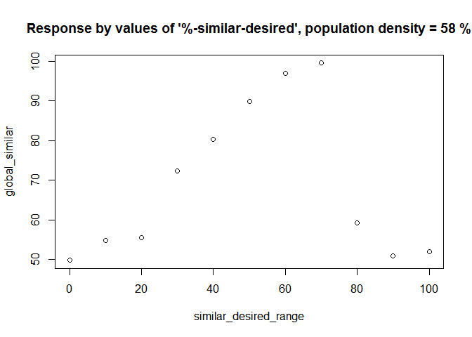 

By observation, it seems that segregation increases with micro-level preference for similar neighbours up to a threshold of about 70-80% desired similar neighbours, at which point there is a sharp decrease to the 50%. Why might this be the case?


### *Task*

Try holding '%-similar-desired' steady, and vary only the population density.
Keep %-similar desired at 50, and run the model at values between 15% and 95%, at increments of 5%. Plot the results


The results should imply that increasing the density of agents tends to decrease segregation, although note the scale on the y-axis.

By holding the one parameter fixed while varying the other, we are preventing ourselves from identifying any interaction between the variables, and leaving large areas of the parameter space unobserved. 

We can see this by simply plotting our design:


```r
# this looks complicated, but I simply combine all inputs points we have already run into a single data frame, and plot them 
design <- data.frame(
  similar_desired = c( similar_desired_range, rep(50, length(seq(15,95,5)))),
  density = c(rep(density,length(similar_desired_range)), seq(15,95,5)))

plot(design)
```

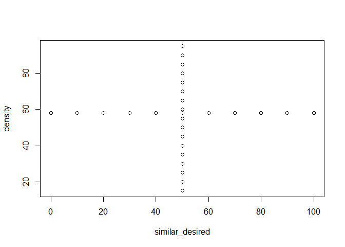 

To examine the corners of the parameter space, and to attempt to capture interactions between the variables, we will now run our simulation on a full factorial design. 
We will use 5 levels (this may take a few moments to run)  


```r
# expand.grid creates an array with all combination of the two arguments given
fact_design <- expand.grid(similar_desired=seq(0,100,25), density = seq(20,98,19))

# plot the design 
plot(fact_design)
```

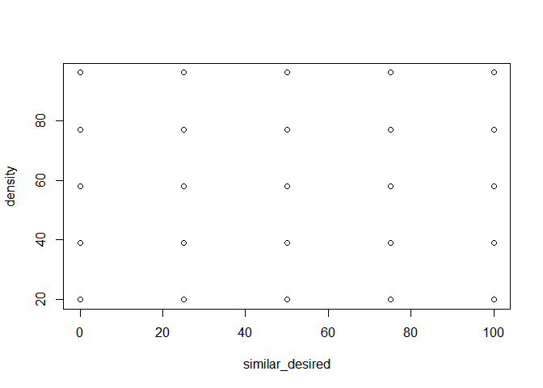 

```r
# fun the model at these combinations, using mapply to iterate through pairs of inputs
fact_response<-mapply(runModel, fact_design$similar_desired, fact_design$density)
```

We can plot this as a surface using the persp command:


```r
persp(
      # get the unique values of each input
      unique(fact_design$similar_desired),
      unique(fact_design$density), 
      # create a matrix of the output values
      matrix(fact_response,nrow =5),
      xlab = "Similar Desired",
      ylab = "Density of Agents",
      zlab = "Response",
      # some parameters governing viewing angle
      theta = 220,
      phi = 30,
      shade = 0.6,
      col = "lightblue"
      )
```

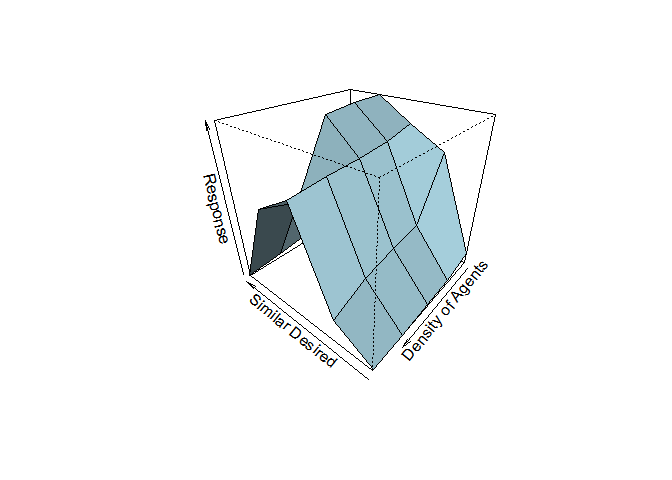 

This looks nice, but generally a contour plot is easier to interpret, and requires
less tuning to find a good viewing angle. 


```r
filled.contour(unique(fact_design$similar_desired),
      unique(fact_design$density), 
      matrix(fact_response,nrow=5),
      xlab = "Similar Desired",
      ylab = "Density of Agents",
      main = "Average % Neighbour Similar by % similar desired and density of agents",
      cex.main = 0.9)
```

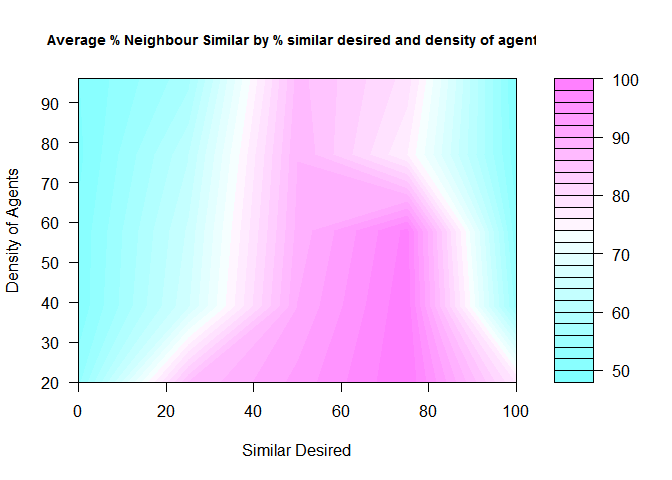 

With both these methods, we have to be carefull to realise that the plot algorithms are interpolating between the points we have observed using a simple meta-model. Also note that the surface is pretty uneven. This is because we are dealling with a *stochastic simulator*, so the unevenness is likely to be attributible to random noise from NetLogo's random number generator. We will talk more about randomness in the part 2 of this workshop. 


# Response surfaces
Now we can start fitting some simple meta-models.
Often it is preferable to standardise the input space so that we can easily compare the effect of different inputs through their regression coefficients.


```r
# transform the input so that it range between 0 and 1.
transformInput <- function(input, location, multiplier){
  transformed_input <- input - location
  return( transformed_input / multiplier )
}

# we need to save these values for later transformations.
locations <- apply(fact_design,2,min)
multipliers <- apply(fact_design,2,max)- locations

# do the transformation by applying the transformInput function
trans_design<-data.frame(mapply(transformInput, fact_design, locations, multipliers))

# for convenience, lets add our outputs as a column in the same data frame
trans_design$response<-fact_response
```

We will start by fitting just a simple linear term for each input.


```r
# we use the standard R linear model command. 
model1<-with(trans_design, lm(response ~ similar_desired + density))
summary(model1)
```

```
## 
## Call:
## lm(formula = response ~ similar_desired + density)
## 
## Residuals:
##    Min     1Q Median     3Q    Max 
## -31.36 -12.94  -1.11  14.67  24.43 
## 
## Coefficients:
##                 Estimate Std. Error t value Pr(>|t|)    
## (Intercept)       72.535      7.964   9.108 6.43e-09 ***
## similar_desired   16.074     10.074   1.596   0.1249    
## density          -18.217     10.074  -1.808   0.0843 .  
## ---
## Signif. codes:  0 '***' 0.001 '**' 0.01 '*' 0.05 '.' 0.1 ' ' 1
## 
## Residual standard error: 17.81 on 22 degrees of freedom
## Multiple R-squared:  0.2091,	Adjusted R-squared:  0.1372 
## F-statistic: 2.908 on 2 and 22 DF,  p-value: 0.07577
```

This is not a good fit to the data, which is unsurprising given we observed significant curvature in our response surface. This curvature cannot be captured by linear terms in our model.
Problems with this model can clearly be identified by plotting the standardised residuals against the similar desired input - we would hope that there is no pattern to these residuals.


```r
# rstandard computes the standarised residuals.
plot(trans_design$similar_desired, rstandard(model1))
```

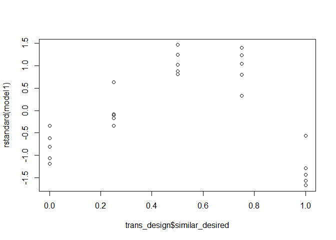 

Let's try adding higher order terms, and an interaction term: 


```r
# Model with interaction and squared terms
model2<- with(trans_design, 
              lm( response ~ similar_desired * density + I (density**2) 
                  + I(similar_desired**2)))
summary(model2)
```

```
## 
## Call:
## lm(formula = response ~ similar_desired * density + I(density^2) + 
##     I(similar_desired^2))
## 
## Residuals:
##      Min       1Q   Median       3Q      Max 
## -16.8854  -5.5040   0.8719   5.0761  17.8671 
## 
## Coefficients:
##                         Estimate Std. Error t value Pr(>|t|)    
## (Intercept)               51.251      6.398   8.010 1.64e-07 ***
## similar_desired          164.240     19.963   8.227 1.10e-07 ***
## density                  -24.522     19.963  -1.228   0.2343    
## I(density^2)              20.511     17.767   1.154   0.2626    
## I(similar_desired^2)    -133.961     17.767  -7.540 3.99e-07 ***
## similar_desired:density  -28.412     14.865  -1.911   0.0712 .  
## ---
## Signif. codes:  0 '***' 0.001 '**' 0.01 '*' 0.05 '.' 0.1 ' ' 1
## 
## Residual standard error: 9.29 on 19 degrees of freedom
## Multiple R-squared:  0.8141,	Adjusted R-squared:  0.7652 
## F-statistic: 16.64 on 5 and 19 DF,  p-value: 2.298e-06
```
This model fits the data much better, and a higher proportion of variance is accounted for, as can be observed from the value of R<sup>2</sup>.
The residuals are still not perfect, but are considerably better than before.


```r
plot(trans_design$similar_desired, rstandard(model2))
```

 

```r
plot(trans_design$density, rstandard(model2))
```

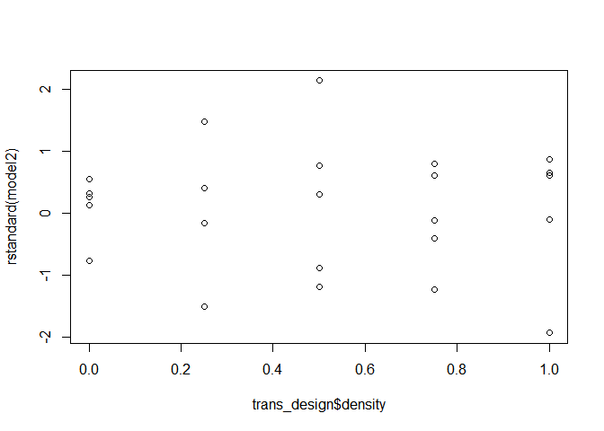 

```r
qqnorm(rstandard(model2))
qqline(rstandard(model2))
```

 


## Validation
If we are to trust the results of meta-model, we need to confirm that it is a good fit for the underlying simulation. The best way of doing this is to run the simulation at new points, and compare these to the model predictions. 


```r
new_points <- data.frame(similar_desired = runif(10, 0, 100), density = runif(10, 20, 95))
valid_response <- mapply(runModel, new_points$similar_desired, new_points$density)


trans_new_points <- data.frame(mapply(transformInput, 
                                    new_points, locations, multipliers))
model_predictions <- predict(model2, trans_new_points)

error <- valid_response - model_predictions

# Root Mean Squared Error
RMSE <- sqrt(sum(error**2) / length(error))

# 'Normalised' RMSE
RMSE/diff(range(trans_design$response))
```

```
## [1] 0.2609512
```

The normalised RMSE is probably too high for this model. The RMSE is a metric for assessing prediction error  based on the root of the average squared error, divided by the range over which the training set response varies. 

This result might be due to the low number of data-points, but more likely it is due to the inadequacy of model we fit. ABM simulation are often too non-linear to expect simple response surfaces such as the one fitted above to do a good job of 'standing in' for the simulation. However, fitting a response surface does help us to understand the way in which the model responds to different inputs.  


The inadequacy of the model in prediction helps to motivate the non-parameteric methods such as kriging used in the next part of the workshop, where no specific functional form is assumed for the meta-model.


## Sensitivity Analysis

We can crudely examine the sensitivity of the model to inputs by considering the
ANOVA decomposition of our model, and comparing the ratios of effect-specific sum of squares to the total:

```r
model_an<-anova(model2)

model_an["Sum Sq"]/sum(model_an["Sum Sq"])
```

```
##                             Sum Sq
## similar_desired         0.09152129
## density                 0.11755573
## I(density^2)            0.01304036
## I(similar_desired^2)    0.55624127
## similar_desired:density 0.03574556
## Residuals               0.18589579
```
Note the percentages sum to one by construction. This indicates that the squared effect of similar-desired is the most significant in our model. This fits with our eyeball intuition, noting the curved nature of the response surface. 

## Other designs
The R package 'lhs' allows easy generation of the LHS sample designs. 

### *Task*
Try using this package and the improvedLHS command to generate an LHS design for the Schelling model, running the model at these points, and fitting a simple metamodel  to the data. 

How does the RMSE for the lhs design compare to the factorial design using the same validation points, the same model and the same number of points?

- *Tip* : The function improvedLHS takes two arguments - the number of inputs to generate, and the number of dimensions.
- *Tip* : It also produces a design scaled to between 0 and 1 You will need to scale it up again to lie in the range of the individual inputs before you run the model.


The main advantage of LHS designs, however, is that you can get away with many fewer runs, particularly in higher dimensions, and when use in combined with kriging-type models.  

## Note on the purpose of meta-models 

It might appear that meta-models don't add much to simple plotting of outputs.
For the example we have used here, this may be the case. We have studied a simple and above all low-dimension problem. 

Once you include more parameters, it becomes more and more difficult to identify interactions by eye, and model-based solutions become imperative. 


#Part 2: Uncertainty quantification and Kriging-based Emulation

In the first part of this workshop we have paid very little attention to the uncertainty inherent in simulation. We will start by examining how Monte Carlo techniques can be used to assess the effect of uncertainty. 

## Assessing uncertainty using Monte Carlo
We will start by working with the forest fire model, again from the NetLogo model library. This model display displays a lot of stochasticity in outputs, and so is a good target for uncertainty analysis. 

It models the spread of fire through a forest. It has only one parameter - the density of the trees in the forest in question. The simulation introduces fire to the edge of the fire, and lets it spread to any nearby trees. We are examining the proportion of burnt trees as an output. 


```r
model.path <- "/models/Sample Models/Earth Science/Fire.nlogo"
NLLoadModel(paste(nl.path, model.path, sep=""))
```

As a test, let's run the simulation a few times at density 60. Note the considerable differences in outputs. 


```r
for (i in 1:4){
  NLCommand("set density 60")
  NLCommand("setup")
  NLDoCommand(1000,"go")
  initial <- NLReport("initial-trees")
  burned  <- NLReport("burned-trees")
  print(burned / initial)
}
```

```
## [1] 0.6097853
## [1] 0.3033274
## [1] 0.6186076
## [1] 0.619806
```


We need to rewrite our runModel function for the new simulation.


```r
runModel<-function(density){
  # function running the model for 1000 ticks at input value 'density'
  # returning the proportion of burned trees
  NLCommand("set density", density)
  NLCommand("setup")
  NLDoCommand(1000, "go")
  return(NLReport("burned-trees / initial-trees"))
}
```

Now lets run the simulation 50 times at the density 60 to start to examine what the output *distribution* looks like at this point. When we are doing this sort of experiment it is useful to check how long each set of runs is going to take - otherwise we might be waiting for simulations that will never end!  

The function'*system.time*' is our friend in this context - look at the third column in the output, "elapsed time" to assess the time taken. When working on this yourself, try this with a small number of runs and mutliply up to get an idea of how long it should take for the desired number.


```r
system.time( proportion_burned_60 <- sapply(rep(60, 50), runModel ))
```

```
##    user  system elapsed 
##    63.3     0.5    60.5
```

```r
hist(proportion_burned_60)
```

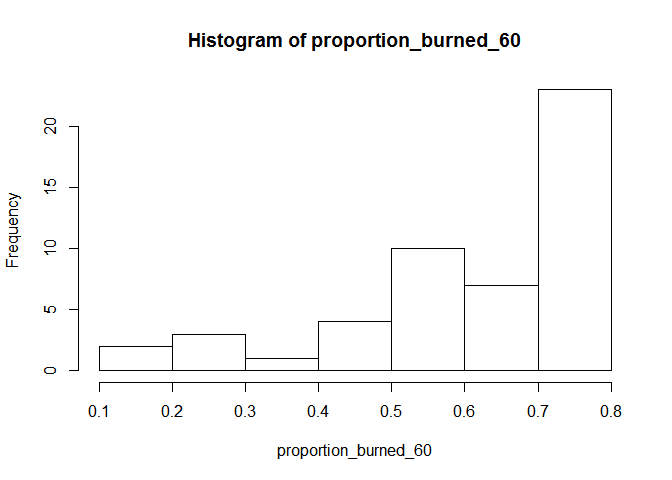 

Notice how the results are spread over almost all the whole of the output space, with most of the density concentrated at the right of the distribution. Ideally we want to consider how this distribution changes across the parameter space.

As we are going to need to repeat our simulation a number of times,  it may be worth harnessing the advantages of parallel computing to speed the process up. 
If your computer has multiple cores, with a bit of setup you can use parallel versions of the apply family of functions to split the work over a number of processors.

This section is based on the RNetLogo package Parallel Processing vignette by Jan Thiele, which you can access by typing "vignette("parallelProcessing","RNetLogo")"


```r
NLQuit()

library("parallel")

# set number of cores to be used

detectCores()
```

```
## [1] 8
```

```r
n_processors <- detectCores() - 1
# I tend to leave one core free, hence the -1, but you may not wish to do this.


#create a cluster object in R
cl<-makeCluster(n_processors)

# set up the random number generators
clusterSetRNGStream(cl)

# create a function to set up the model on each core
setupModel<-function(nl.path, model.path){
  library(RNetLogo)
  NLStart(nl.path, gui=F)
  NLLoadModel(paste(nl.path, model.path, sep="")) 
}

# use the parallel version of sapply to run the function on each core
invisible(parSapply(cl, rep(nl.path, n_processors), setupModel, model.path))
```


Now that we have a parallel cluster set up, let's try a few more runs:


```r
# run model using parSapply, and combine results with those from before.

system.time(
  proportion_burned_60_par <- parSapply(cl, rep(60,100), runModel)
  )
```

```
##    user  system elapsed 
##    0.00    0.00   49.61
```

```r
proportion_burned_60 <- c( proportion_burned_60,  proportion_burned_60_par)
```
Hopefully you should notice that this took less time per run than before! We did twice as many runs this time, so we would hope the elapsed time is considerably less than twice the previous value. If not, this is probably due to the overhead associated with sending information to different cores and putting it back together again. The more runs you are hoping to do, the more likely it is that you will be able to see benefits from parallelising your model runs.

Note that if you are running this on a Mac or a LINUX based system such as Ubuntu, then you might be able to use the much simpler mclapply function (which, in my experience, is also faster).  

Let's plot our outputs. We can also use the 'density' command to plot the smoothed continuous density of our observations.


```r
hist(proportion_burned_60,breaks = 15)
```

 

```r
plot( density( proportion_burned_60 ) )
```

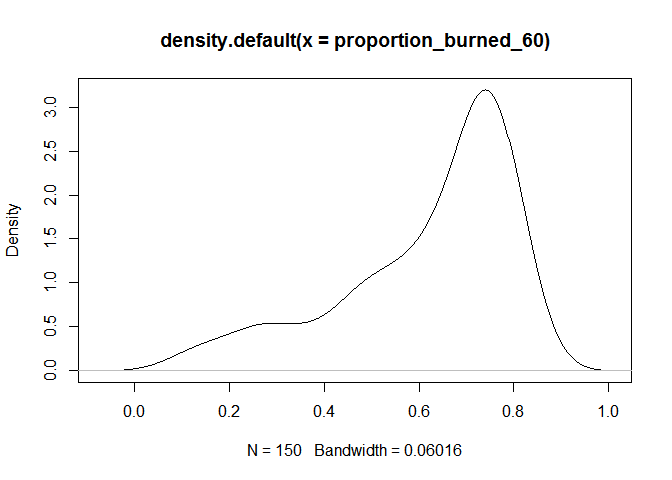 

```r
var(proportion_burned_60)
```

```
## [1] 0.02423049
```

We now have 150 runs, and we can see from the above histogram that the distribution is pretty irregular. Clearly, a normality assumption will not be appropriate in this case. 


### *Task*
Try and build up a picture of the uncertainty caused by simulation stochasticity across the following values of density by running repeat trials at each value, and examine the variance.
There is no need to do 150 runs at each point given time constraints, however - try around 25.


```r
densities<-seq(51, 81, 6)
```


###*Task*
Next, let's assume we have some prior information about the density of a particular forest we are interested in. We want to know what the probability of various proportions of forest destruction is, given our prior information, which is expressed as a probability distribution over possible density values.

Our prior assumption is that the density of the forest has a normal distribution with mean 56 and sd 1.5 . Sample from this distribution using rnorm, and run the simulation at the sampled points. Plot the density of this output distribution. 

Now try the same exercise, but just hold the input steady at its mean value, and examine the difference between the two distributions. 


This is an example of incorporating the effect of *input uncertainty* into our output predictions. (Note this is NOT a case of full Bayesian updating - we have not applied Bayes rule to get a posterior, but used the prior and the model to induce a distribution on our output variable).


```r
# tidy up by closing NetLogo on each core, and stopping the cluster.
clusterEvalQ(cl, NLQuit())
```

```
## [[1]]
## [1] "C:/Program Files (x86)/NetLogo 5.2.1"
## 
## [[2]]
## [1] "C:/Program Files (x86)/NetLogo 5.2.1"
## 
## [[3]]
## [1] "C:/Program Files (x86)/NetLogo 5.2.1"
## 
## [[4]]
## [1] "C:/Program Files (x86)/NetLogo 5.2.1"
## 
## [[5]]
## [1] "C:/Program Files (x86)/NetLogo 5.2.1"
## 
## [[6]]
## [1] "C:/Program Files (x86)/NetLogo 5.2.1"
## 
## [[7]]
## [1] "C:/Program Files (x86)/NetLogo 5.2.1"
```

```r
stopCluster(cl)
```


# Kriging and Gaussian Processes

## Kriging Models with DiceKriging

Here we will go back to our Schelling model and fit two different kriging models. 

We will start by examining the `DiceKriging` package, which you will need to install from CRAN. This package uses the `km` command to create a kriging model object in the same way as the `lm` linear model command.

Use the LHS sample and associated response you created earlier to fit the model.


```r
lhs_design$response<-lhs_response
library("DiceKriging")

kriging_m1<-km(response~similar_desired + density, lhs_design[,c(1,2)], lhs_design[,3], nugget.estim=T)
```

```
## 
## optimisation start
## ------------------
## * estimation method   : MLE 
## * optimisation method : BFGS 
## * analytical gradient : used
## * trend model : ~similar_desired + density
## * covariance model : 
##   - type :  matern5_2 
##   - nugget : unknown homogenous nugget effect 
##   - parameters lower bounds :  1e-10 1e-10 
##   - parameters upper bounds :  193.2799 146.0882 
##   - upper bound for alpha   :  1 
##   - best initial criterion value(s) :  -87.19598 
## 
## N = 3, M = 5 machine precision = 2.22045e-16
## At X0, 0 variables are exactly at the bounds
## At iterate     0  f=       87.196  |proj g|=      0.34926
## At iterate     1  f =       86.734  |proj g|=       0.27856
## At iterate     2  f =       86.616  |proj g|=          0.21
## At iterate     3  f =       86.422  |proj g|=      0.054988
## At iterate     4  f =       86.402  |proj g|=       0.01449
## At iterate     5  f =         86.4  |proj g|=     0.0093741
## At iterate     6  f =         86.4  |proj g|=     0.0090784
## At iterate     7  f =         86.4  |proj g|=     0.0090665
## 
## iterations 7
## function evaluations 9
## segments explored during Cauchy searches 8
## BFGS updates skipped 0
## active bounds at final generalized Cauchy point 1
## norm of the final projected gradient 0.00906646
## final function value 86.4
## 
## F = 86.4
## final  value 86.399958 
## converged
```

```r
kriging_m1
```

```
## 
## Call:
## km(formula = response ~ similar_desired + density, design = lhs_design[, 
##     c(1, 2)], response = lhs_design[, 3], nugget.estim = T)
## 
## Trend  coeff.:
##                   Estimate
##     (Intercept)    87.9213
## similar_desired     0.0249
##         density    -0.3415
## 
## Covar. type  : matern5_2 
## Covar. coeff.:
##                          Estimate
## theta(similar_desired)    13.2356
##         theta(density)    49.0992
## 
## Variance estimate: 210.875
## 
## Nugget effect estimate: 2.10875e-06
```

The dice kriging command fits a kriging model, so that data point estimates are the sum of a linear trend and deviations from this trend drawn from a Gaussian process.

The trend coefficients are the first elements of the output, and include an intercept and a linear term for each parameter. The output also tells us that the a matern5_2 kernel was used - which defines the shape of the covariance function. Other kernels are available - experiment with them if you wish.  It also gives us the estimates of the correlation parameters (here 'theta'), and the variance and nugget effects. 

The nugget effect here accounts for simulation stochasticity, while the variance parameter refers to input related variance. 

We can make predictions for new values using the predict command. Lets make predictions across the whole parameter space. 


```r
similar_ins<-seq(0,100,2)
densities_ins<-seq(20,95,5)

fullSpace<- data.frame(expand.grid(similar_ins, densities_ins))
dim(fullSpace)
```

```
## [1] 816   2
```

```r
#lots of points!

colnames(fullSpace)<-colnames(lhs_design[,1:2])


predictions<-predict(kriging_m1, fullSpace, "UK")

prediction.surface<-matrix(predictions$mean, 51)

filled.contour(similar_ins, densities_ins, prediction.surface )
```

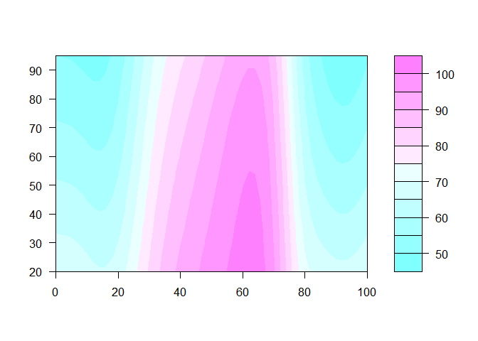 

### *Optional Task*
Try constructing the same plot for predictions from the earlier quadratic model using lm.
What do you notice? 


## Gaussian Process Models with GEM-SA
We can also try fitting the same model in the software GEM-SA (with kind thanks to Marc Kennedy for permission).
This is available as a stand-alone application here: [http://ctcd.group.shef.ac.uk/gem.html](http://ctcd.group.shef.ac.uk/gem.html)

To use the software, we first of all need to save our simulation inputs and results in a format that can be read by the software.


```r
#set your working directory somewhere sensible so you can find these files later!
write.table(lhs_design[,1:2], file="inputs.txt",row.names=F, col.names=F)
write.table(lhs_design[,3], file="outputs.txt",row.names=F, col.names=F)
```

Now open GEM-SA. 

1. From the menu, choose the 'Project / new ' option.  

2. Next, in the resulting dialogue box, pick the inputs file you have just saved from the browse menu.  

3. Similarly, browse to your outputs file. Leave predictions blank for the moment.  
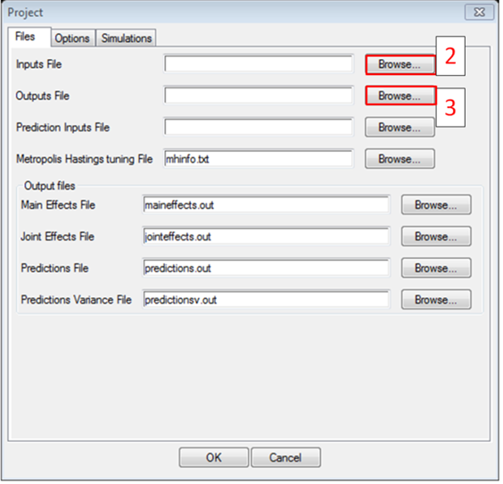 

4. Now, click on the options tab. We have two inputs, so input '2' in the number of inputs box. You can name them appropriately if you wish by pressing the 'Names' button.     

5. Tick the 'code has numerical error' box. In our language, this means that we have a simulation stochasticity, and we want GEM-SA to estimate a nugget term.  

6. Under the Input uncertainty options, check the All unknown, product normal option.
This states that we do not know for certain the true values of the parameters in questions, but we expect them to be jointly normal.  
 

7. Don't worry about the simulations tab - this refers only to the MCMC parameter estimation procedure.  

8. Press OK. You will be prompted to enter prior means and variance for your input variables. Press the 'use default' button to set use empirical estimated parameters based on the input values we have given GEM-SA.  

9. We're ready to go. Press the red play button at the top of the window!  

#Output Analysis
You should be able to see some plots of the main effects for our two variables. 
If you go to the sensitivity analysis tab, you will a variance based sensitivity analysis - this takes into account the non-parametric deviations from the linear trend that were unable to capture with our ANOVA earlier in the workshop.   

In the 'Output summary' tab, you should be able to see the variance (sigma-squared) and nugget parameters, and roughness parameters which we also estimated using DiceKriging.  


At the bottom of the screen, you can also see the mean expected of the simulation output **given the distributions of our inputs**, and the variance of this expectation.
The final value is the total expected variance of the output, again given our input priors.   

## Task
Try changing some of the other options (click on the pen to get back to the options screen). In particular, ask GEM-SA to calculate joint effects, and also attempt to validate the emulator accuracy using leave one out validation - the root mean squared standardised error should ideally be less than two.  

Try examining how changes in the prior distributions impact upon the sensitivity and uncertainty analyses. Does this fit with your expectations?   


# Appendix: Reading and Software

A number of R packages might be able to help you in designing and analysing computer experiments.

##R packages
1. 'lhs':  Provides simple functions to calculate latin hypercube samples. Note that optimumLHS can sometimes be expensive in high dimensions, so the other options are generally best. Augment is also a useful function if you need to add more points eg. for -crossvalidation
2. 'DiceKriging': excellent non-Bayesian computater experiment package
3. 'tgp':  a bit more complex. Fits 'treed' Gaussian process
4. 'BACCO': implementation of Kennedy and O'Hagan's emulator framework. Deterministic models only, so not always useful
5. 'AlgDesign' :  For generating fraction factorials
6. 'rsm' : Response surface methodology package.

##Other Software
1. Gaussian Process Matlab packages : Algorithms relating to the Rasmussen and Williams excellent book on Gaussian Processes for Machine learning. Both book and software available free online here:
[http://www.gaussianprocess.org/](http://www.gaussianprocess.org/)
Cutting edge. 
2. GEM-SA :  Marc Kennedy's stand-alone gui for Gaussian Processes. Works very well, but is opaque and difficult to integrate with R. [http://ctcd.group.shef.ac.uk/gem.html](http://ctcd.group.shef.ac.uk/gem.html)

##Reading

**Managing Uncertainty in Complex Models Toolkit** (2011), MUCM project, [http://mucm.aston.ac.uk/toolkit/index.php?page=MetaHomePage.html](http://mucm.aston.ac.uk/toolkit/index.php?page=MetaHomePage.html) 

**Santer, W., Williams, B, and Notz, W** (2003)  *'Design and Analysis of Computer Experiments'*, Springer  

##Model Citations
Wilensky, U. (1997). NetLogo Segregation model. http://ccl.northwestern.edu/netlogo/models/Segregation. Center for Connected Learning and Computer-Based Modeling, Northwestern Institute on Complex Systems, Northwestern University, Evanston, IL.

Wilensky, U. (1997). NetLogo Fire model. http://ccl.northwestern.edu/netlogo/models/Fire. Center for Connected Learning and Computer-Based Modeling, Northwestern University, Evanston, IL.

